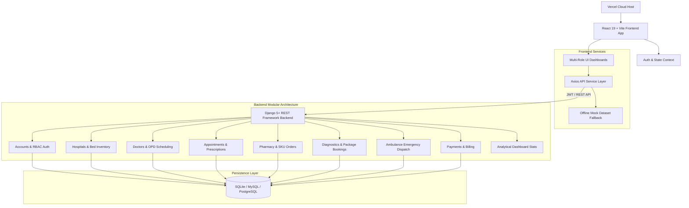

# Purnia Care - Healthcare & Hospital Management Platform

[](LICENSE)
[](https://vercel.com)
[](backend/)
[](frontend/)
[](frontend/)

**Purnia Care** is an all-in-one digital healthcare ecosystem designed for regional health networks, patients, doctors, hospitals, pharmacies, diagnostic centers, and ambulance providers. It seamlessly connects clinical appointment bookings, real-time hospital bed availability tracking, emergency ambulance dispatch, online pharmacy inventory with shopping cart ordering, diagnostic package tests, and multi-role analytical dashboards.

> [!NOTE]  
> **Deployment Target**: The Purnia Care web application is optimized for deployment on **Vercel** with a root `vercel.json` configuration and automated client-side routing rewrites.

---

## Key Features

- **Multi-Role Role-Based Access Control (RBAC)**: Supports 6 distinct roles (`Patient`, `Doctor`, `Hospital Admin`, `Super Admin`, `Diagnostic Admin`, and `Ambulance Driver`).
- **Hosted on Vercel**: Optimized single-page application build (`frontend/dist`) with root deployment configuration (`vercel.json`).
- **Stateless JWT Authentication**: Secure user session handling via DRF `SimpleJWT` with token refresh logic and persistent AuthContext in React.
- **Telemedicine & Doctor Bookings**: Interactive doctor search by specialty, OPD availability calendar, appointment scheduling, and digital prescription issuance.
- **Hospital Bed & ICU Management**: Real-time hospital directory with department breakdown, total vs available bed monitoring, and emergency admission requests.
- **Emergency Ambulance Dispatch System**: Instant ambulance request booking with vehicle type selection (Basic, ICU, Ventilator), fleet tracking, and driver status dispatch.
- **Online Pharmacy & Medicine Delivery**: Searchable medicine SKU database with dosage details, shopping cart management, prescription uploads, and order fulfillment.
- **Diagnostic Test Packages**: Diagnostic center catalog, health checkup package comparisons, sample collection slot booking, and digital lab test reports.
- **Unified Custom JSON API Standard**: Backend outputs a predictable envelope structure via `PurniaJSONRenderer` (`{"success": true, "message": "...", "data": {...}}`).
- **Hybrid Data Layer**: Integrated REST API service (`apiService.js`) with an offline mock dataset fallback (`mockData.js`) for seamless deployment and offline client demonstration.

---

## System Architecture



---

## Repository Structure

```text
purneacare/
├── vercel.json               # Vercel deployment configuration for monorepo
├── backend/                  # Django REST API Backend
│   ├── accounts/             # Custom User model, authentication & OTP
│   ├── ambulance/            # Emergency dispatch fleet & driver matching
│   ├── appointments/         # Clinical bookings & digital prescriptions
│   ├── common/               # Base models, seed scripts & PurniaJSONRenderer
│   ├── config/               # Django settings, WSGI, URLs & SimpleJWT config
│   ├── dashboard/            # Analytical charts & aggregate metrics API
│   ├── diagnostics/          # Lab test packages & booking center
│   ├── doctors/              # Doctor profiles, specialties & review ratings
│   ├── hospitals/            # Hospital directories & live bed availability
│   ├── medicines/            # Medicine SKU inventory & categories
│   ├── notifications/        # User alert messaging & notifications
│   ├── patients/             # Patient clinical profiles & medical records
│   ├── payments/             # Transactions & billing ledger
│   ├── pharmacy/             # Cart checkout, shipping & order fulfillment
│   ├── docker-compose.yml    # Docker orchestration setup
│   ├── manage.py             # Django CLI manager
│   ├── requirements.txt      # Python dependencies
│   └── render.yaml           # Render backend deployment specification
├── frontend/                 # React 19 + Vite Frontend Application
│   ├── public/               # Static assets & favicon
│   ├── src/
│   │   ├── components/       # Reusable UI widgets & Navbar/Footer
│   │   ├── context/          # AuthContext, ThemeContext, CartContext
│   │   ├── layouts/          # Dashboard Layout & Main Layout wrappers
│   │   ├── pages/            # Public catalog pages & 6 role dashboards
│   │   ├── routes/           # Protected routes & AppRoutes setup
│   │   └── services/         # apiService.js & mockData.js fallback
│   ├── package.json          # Node dependencies & build scripts
│   ├── vite.config.js        # Vite & Tailwind v4 plugin configuration
│   └── vercel.json           # Vercel SPA rewrite rules
├── docs/                     # Technical architecture documentation
├── CONTRIBUTING.md           # Developer contribution guide
└── render.yaml               # Backend blueprint specification
```

---

## Tech Stack

| Domain | Technology | Description |
|---|---|---|
| **Hosting & CDN** | Vercel Platform | High-speed global edge network deployment |
| **Frontend Framework**| React 19 + Vite | High-performance SPA frontend with HMR |
| **Styling & UI** | Tailwind CSS v4 + Framer Motion | Modern atomic styling & fluid micro-interactions |
| **Backend Framework** | Django 5.x + Django REST Framework | Production-ready python web framework & REST API builder |
| **Authentication** | `djangorestframework-simplejwt` | JSON Web Token auth with Access/Refresh lifecycle |
| **API Documentation**| `drf-spectacular` | OpenAPI 3.0 schema generation & interactive Swagger UI |
| **Database** | SQLite (Dev) / MySQL or PostgreSQL (Prod) | Abstracted ORM database switcher via `.env` |
| **Data Viz & Charts**| Chart.js + `react-chartjs-2` | Interactive analytics charts for dashboard metrics |

---

## Deploying to Vercel

The project is pre-configured for one-click Vercel hosting using GitHub integration:

### Option A: Import via Vercel Dashboard (Recommended)

1. Go to [Vercel Dashboard](https://vercel.com/new).
2. Import the repository: `https://github.com/Sarojkusingh/new-project.git`.
3. Vercel automatically detects the root `vercel.json` configuration:
   - **Framework Preset**: Vite
   - **Build Command**: `cd frontend && npm install && npm run build`
   - **Output Directory**: `frontend/dist`
4. Click **Deploy**. Vercel will build and assign a production URL (e.g., `https://new-project-purneacare.vercel.app`).

### Option B: Deploy via Vercel CLI

```bash
# Install Vercel CLI globally
npm install -g vercel

# Deploy from repository root
vercel --prod
```

---

## Local Development Quickstart

### 1. Setup Backend (Django REST)

```powershell
cd backend
python -m venv venv
.\venv\Scripts\activate
pip install -r requirements.txt
python manage.py migrate
python manage.py seed_data
python manage.py runserver
```

---

### 2. Setup Frontend (React 19 + Vite)

```powershell
cd frontend
npm install
npm run dev
```
Open `http://localhost:5173/` in your browser.

---

## Pre-seeded Demo Credentials

| Role | Username / Email | Password | Access Level |
|---|---|---|---|
| **Patient** | `aman_verma` / `patient@purniacare.com` | `password123` | Patient Profile, Medical Records, Cart, Appointments |
| **Doctor** | `dr_kumar` / `doctor@purniacare.com` | `password123` | Prescription Issuer, OPD Schedule, Patient Consultations |
| **Hospital Admin** | `hosp_admin` / `hospital@purniacare.com` | `password123` | Bed Management, Department Specs, Admission Requests |
| **Super Admin** | `pc_admin` / `admin@purniacare.com` | `password123` | Global Platform Metrics, Users Management, Master Controls |
| **Diagnostic Admin**| `diag_admin` / `diagnostic@purniacare.com` | `password123` | Test Package Catalog, Lab Report Uploads, Slot Booking |
| **Ambulance Driver**| `driver_ramesh` / `driver@purniacare.com` | `password123` | Dispatch Requests, Emergency Location, Trip Status |

---

## Contributing

We welcome contributions! Please refer to [CONTRIBUTING.md](CONTRIBUTING.md) for guidelines on code formatting, pull requests, git workflow, and testing.

## License

This project is licensed under the [MIT License](LICENSE).
