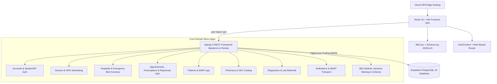

# DocSpot 2.0 - Unified Healthcare Data & Workflow Network

[](LICENSE)
[](https://docspot.vercel.app)
[](backend/)
[](frontend/)
[](frontend/)
[](backend/)

**DocSpot 2.0** is an enterprise-grade, multi-application digital healthcare ecosystem connecting Patients (Public) with Healthcare Providers (Doctors, Clinics, Hospitals, Diagnostic Laboratories, Pharmacies, and Medical Transportation Fleets).

Instead of treating appointment booking, electronic medical records (EMR), diagnostic referrals, medicine fulfillment, and emergency transport as isolated tools, DocSpot 2.0 operates as an integrated workflow network with strict Role-Based Access Control (RBAC), privacy safeguards, and programmatic SEO.

---

## 🌟 Benchmark Innovations (Practo, Zocdoc & Uber Health Models)

1. **Practo Benchmark**:
   - **24/7 On-Demand Instant GP Teleconsultation**: WebRTC video/chat queue matching patients with online General Practitioners in under 60 seconds.
   - **Token-Locked Verified Reviews**: Ratings locked behind completed appointment tokens (`status === 'COMPLETED'`) to eliminate fake reviews.
2. **Zocdoc Benchmark**:
   - **Pre-Visit Digital Intake Forms**: Collects allergies, current medications, primary complaints, and insurance/Ayushman Bharat ABHA IDs post-booking, pre-filling directly into the Doctor's EMR Writer.
   - **Smart Cancellation Waitlist Auto-Fill**: Instant notification system allowing waitlisted patients to claim open slots when cancellations occur.
3. **Uber Health Benchmark**:
   - **Dual Transportation Dispatch**:
     - 🚨 **Emergency 911 Ambulance Mode**: Immediate lights-and-siren ambulance dispatch with live telemetry tracking.
     - 🚘 **Scheduled NEMT Transport Mode**: Non-Emergency Medical Transportation (wheelchair van / cab pickup scheduled 1 hour before appointment time).

---

## 🔍 Programmatic SEO & Dynamic Schema.org JSON-LD Engine

- **Search-Engine Optimized Dynamic URLs**: Programmatic routing (`/doctors/:specialty/:city`, `/doctor/:doctor_slug`, `/hospitals/:city/icu-beds`).
- **Schema.org Structured Data (JSON-LD)**: Embedded `Physician` and `Hospital` structured data for Google Rich Snippets (star ratings, consultation fees, location pins, and live bed counts).
- **Automated XML Sitemap & Robots.txt**: Dynamic backend `/sitemap.xml` endpoint generator and `/robots.txt` indexing rules.

---

## 🏗️ Technical Architecture



---

## 🚀 Getting Started Locally

### 1. Backend Service Setup (Django REST Framework)

```bash
# Navigate to backend directory
cd backend

# Create & activate virtual environment (Windows PowerShell)
python -m venv venv
.\venv\Scripts\Activate.ps1

# Install requirements
pip install -r requirements.txt

# Execute database migrations
python manage.py migrate

# Seed mock clinical datasets
python manage.py seed_data

# Run backend development server
python manage.py runserver 8000
```

### 2. Frontend SPA Setup (React 19 + Vite)

```bash
# Navigate to frontend directory
cd frontend

# Install Node dependencies
npm install

# Start Vite local development server
npm run dev
```

The application will be accessible at:
- **Frontend SPA**: `http://localhost:5173`
- **Backend API**: `http://localhost:8000/api/`
- **OpenAPI Swagger Docs**: `http://localhost:8000/api/docs/`
- **Dynamic Sitemap**: `http://localhost:8000/sitemap.xml`

---

## 📦 Deployment Configuration

- **Vercel (Frontend)**: Includes root `vercel.json` with SPA route rewrites (`/(.*) -> /index.html`).
- **Render (Backend)**: Production WSGI/Gunicorn container definition in `render.yaml`.
- **Repository**: [https://github.com/KrishRaj-0821/DocSpot2.o.git](https://github.com/KrishRaj-0821/DocSpot2.o.git)

---

## 📄 License

This project is licensed under the MIT License - see the [LICENSE](LICENSE) file for details.
