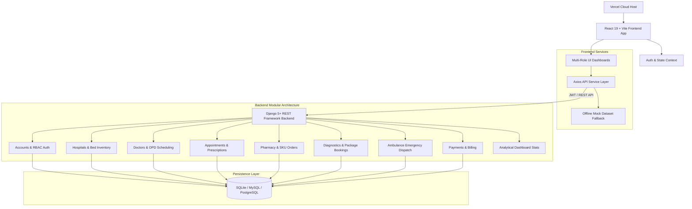

# DocSpot - Healthcare & Hospital Management Platform

[](LICENSE)
[](https://vercel.com)
[](backend/)
[](frontend/)
[](frontend/)

**DocSpot** is an all-in-one digital healthcare ecosystem designed for regional health networks, patients, doctors, hospitals, pharmacies, diagnostic centers, and ambulance providers. It seamlessly connects clinical appointment bookings, real-time hospital bed availability tracking, emergency ambulance dispatch, online pharmacy inventory with shopping cart ordering, diagnostic package tests, and multi-role analytical dashboards.

> [!NOTE]  
> **Deployment Target**: The DocSpot web application is optimized for deployment on **Vercel** with a root `vercel.json` configuration and automated client-side routing rewrites.

---

## Key Features

- **Multi-Role Role-Based Access Control (RBAC)**: Supports 6 distinct roles (`Patient`, `Doctor`, `Hospital Admin`, `Super Admin`, `Diagnostic Admin`, and `Ambulance Driver`).
- **Hosted on Vercel**: Optimized single-page application build (`frontend/dist`) with root deployment configuration (`vercel.json`).
- **Stateless JWT Authentication**: Secure user session handling via DRF `SimpleJWT` with token refresh logic and persistent AuthContext in React.
- **Telemedicine & Doctor Bookings**: Interactive doctor search by specialty, OPD availability calendar, appointment scheduling, and digital prescription issuance.
- **Hospital Bed & ICU Management**: Real-time hospital directory with department breakdown, total vs available bed monitoring, and emergency admission requests.
- **Emergency Ambulance Dispatch System**: Instant ambulance request booking with vehicle type selection (Basic, ICU, Ventilator), fleet tracking, and driver status dispatch.
- **Online Pharmacy & Medicine Delivery**: Searchable medicine SKU database with dosage details, shopping cart management, prescription uploads, and order fulfillment.
- **Diagnostic Test Packages**: Diagnostic center catalog, health checkup package comparisons, sample collection slot booking, and digital lab test reports.
- **Unified Custom JSON API Standard**: Backend outputs a predictable envelope structure via `DocSpotJSONRenderer` (`{"success": true, "message": "...", "data": {...}}`).
- **Hybrid Data Layer**: Integrated REST API service (`apiService.js`) with an offline mock dataset fallback (`mockData.js`) for seamless deployment and offline client demonstration.

---

## System Architecture



---

## Project Organization

### Directory Structure

```text
docspot/
├── vercel.json                   # Root Vercel build config (monorepo entry)
├── render.yaml                   # Render.com backend deployment blueprint
├── README.md                     # This file
├── CONTRIBUTING.md               # Contributor guidelines
│
├── docs/
│   └── ARCHITECTURE.md           # Detailed system architecture documentation
│
├── backend/                      # ── Django 5+ REST API Backend ──
│   ├── config/                   # Project-level configuration
│   │   ├── settings.py           # Django settings (JWT, CORS, DRF, Spectacular)
│   │   ├── urls.py               # Root URL router (API + Swagger)
│   │   ├── wsgi.py               # WSGI application entry point
│   │   └── asgi.py               # ASGI application entry point
│   │
│   ├── accounts/                 # Auth & user management
│   │   ├── models.py             # Custom AbstractUser with role field
│   │   ├── serializers.py        # Registration, login & profile serializers
│   │   └── views.py              # JWT login, register, profile endpoints
│   │
│   ├── common/                   # Shared utilities & seed data
│   │   ├── models.py             # Abstract base timestamped model
│   │   ├── renderers.py          # DocSpotJSONRenderer (unified envelope)
│   │   └── management/commands/
│   │       └── seed_data.py      # CLI: python manage.py seed_data
│   │
│   ├── hospitals/                # Hospital directory & bed management
│   ├── doctors/                  # Doctor profiles, specialties & ratings
│   ├── appointments/             # Booking engine & prescription PDFs
│   │   ├── views.py              # Appointment CRUD + PDF generation
│   │   ├── pdf_utils.py          # ReportLab prescription PDF builder
│   │   └── appointment_pdf.py    # Appointment confirmation PDF
│   ├── patients/                 # Patient records & medical history
│   ├── pharmacy/                 # Cart, orders & order fulfillment
│   ├── medicines/                # Medicine SKU catalog & categories
│   ├── diagnostics/              # Lab packages & slot booking
│   ├── ambulance/                # Emergency dispatch & fleet tracking
│   ├── dashboard/                # Aggregated analytics & metrics API
│   ├── notifications/            # User alerts & messaging
│   ├── payments/                 # Transactions & billing ledger
│   │
│   ├── manage.py                 # Django CLI entry point
│   ├── requirements.txt          # Python dependencies
│   ├── Dockerfile                # Container image definition
│   └── docker-compose.yml        # Local multi-container orchestration
│
└── frontend/                     # ── React 19 + Vite SPA Frontend ──
    ├── index.html                # SPA entry point (Vite template)
    ├── vite.config.js            # Vite + Tailwind CSS v4 plugin config
    ├── vercel.json               # SPA rewrite rules (React Router fix)
    │
    ├── public/
    │   ├── favicon.svg           # DocSpot brand icon (map-pin + cross)
    │   ├── icons.svg             # App icon sprite sheet
    │   ├── 404.html              # SPA fallback for static hosting
    │   └── _redirects            # Netlify/CDN SPA redirect rule
    │
    └── src/
        ├── main.jsx              # React DOM root mount
        ├── App.jsx               # Root component & router setup
        │
        ├── context/              # Global React state (Context API)
        │   ├── AuthContext.jsx   # JWT auth state, login/logout logic
        │   ├── CartContext.jsx   # Shopping cart state & item count
        │   └── ThemeContext.jsx  # Dark/light mode toggle
        │
        ├── layouts/              # Page layout wrappers
        │   ├── PublicLayout.jsx  # Navbar + Footer shell for public pages
        │   └── DashboardLayout.jsx # Sidebar + header shell for dashboards
        │
        ├── components/           # Reusable shared UI components
        │   ├── Navbar.jsx        # Sticky top nav with auth & cart
        │   ├── Footer.jsx        # Site footer with links & contact
        │   ├── Sidebar.jsx       # Role-aware dashboard sidebar
        │   ├── SEO.jsx           # Dynamic title & meta tag manager
        │   ├── Loader.jsx        # Page, spinner & skeleton loaders
        │   └── Modal.jsx         # Generic modal dialog component
        │
        ├── pages/
        │   ├── public/           # Public-facing pages (no auth required)
        │   │   ├── Home.jsx      # Landing page with hero & service cards
        │   │   ├── Doctors.jsx   # Doctor search & specialty filter
        │   │   ├── BookDoctor.jsx# Doctor profile & appointment booking
        │   │   ├── Hospitals.jsx # Hospital directory & bed availability
        │   │   ├── Diagnostics.jsx# Lab test package catalog
        │   │   ├── Medicines.jsx # Online pharmacy & cart
        │   │   ├── Ambulance.jsx # Emergency ambulance booking
        │   │   ├── About.jsx     # About DocSpot
        │   │   ├── Contact.jsx   # Contact form
        │   │   ├── Login.jsx     # JWT login form
        │   │   ├── Register.jsx  # Multi-role registration
        │   │   └── VerifyAppointment.jsx # QR appointment verification
        │   │
        │   ├── dashboard/        # Role-gated dashboard pages
        │   │   ├── patient/      # Medical records, orders, prescriptions
        │   │   ├── doctor/       # OPD schedule, prescriptions, patients
        │   │   ├── hospital/     # Bed management, admission requests
        │   │   ├── admin/        # Super admin: users, metrics, controls
        │   │   ├── pharmacy/     # Inventory, orders, analytics
        │   │   └── diagnostics/  # Test packages, bookings, lab reports
        │   │
        │   └── errors/           # 404 & error boundary pages
        │
        ├── routes/
        │   └── AppRoutes.jsx     # All routes + ProtectedRoute HOC
        │
        ├── services/
        │   ├── apiService.js     # Axios instance + all API call methods
        │   └── mockData.js       # Offline dataset fallback
        │
        └── utils/
            ├── pdfUtils.js           # Prescription PDF generator (jsPDF)
            ├── generateInvoicePDF.js # Pharmacy invoice PDF
            └── generateReportPDF.js  # Pharmacy analytics report PDF
```

---

## Frontend Architecture

### Data Flow

```
User Interaction
      │
      ▼
  React Component  ──reads──▶  Context (Auth / Cart / Theme)
      │
      ▼
  apiService.js  ──axios──▶  Django REST API  ──▶  Database
      │
      └──fallback──▶  mockData.js  (when API is offline)
```

### Route & Auth Guard Structure

| Route Pattern | Layout | Auth Required | Roles |
|---|---|---|---|
| `/` `/doctors` `/hospitals` `/medicines` `/diagnostics` `/ambulance` | PublicLayout | ❌ No | All |
| `/login` `/register` | PublicLayout | ❌ No | Guest only |
| `/patient/*` | DashboardLayout | ✅ Yes | `patient` |
| `/doctor/*` | DashboardLayout | ✅ Yes | `doctor` |
| `/hospital/*` | DashboardLayout | ✅ Yes | `hospital` |
| `/admin/*` | DashboardLayout | ✅ Yes | `admin` |
| `/pharmacy/*` | DashboardLayout | ✅ Yes | `pharmacy_admin` |
| `/diagnostics-admin/*` | DashboardLayout | ✅ Yes | `diagnostic_admin` |

### Context Providers

| Context | Purpose | Key Values |
|---|---|---|
| `AuthContext` | JWT session management | `user`, `login()`, `logout()`, `token` |
| `CartContext` | Pharmacy cart state | `cartItems`, `cartCount`, `addToCart()` |
| `ThemeContext` | Dark/light mode | `darkMode`, `toggleDarkMode()` |

---

## Backend Architecture

### API Module Responsibilities

| Django App | Endpoints | Key Models |
|---|---|---|
| `accounts` | `/api/auth/login` `/register` `/profile` | `User` (custom AbstractUser + role) |
| `hospitals` | `/api/hospitals/` | `Hospital`, `Department`, `Bed` |
| `doctors` | `/api/doctors/` `/specialties/` `/reviews/` | `Doctor`, `Specialty`, `Review` |
| `appointments` | `/api/appointments/` `/prescriptions/` | `Appointment`, `Prescription` |
| `patients` | `/api/patients/` `/medical-records/` | `Patient`, `MedicalRecord` |
| `pharmacy` | `/api/pharmacy/orders/` `/cart/` | `Order`, `CartItem` |
| `medicines` | `/api/medicines/` `/categories/` | `Medicine`, `Category` |
| `diagnostics` | `/api/diagnostics/` `/bookings/` | `DiagnosticCenter`, `Booking` |
| `ambulance` | `/api/ambulance/` `/dispatch/` | `Ambulance`, `DispatchRequest` |
| `dashboard` | `/api/dashboard/stats/` | Aggregated read-only views |
| `notifications` | `/api/notifications/` | `Notification` |
| `payments` | `/api/payments/` | `Transaction` |

### Unified API Response Format

All API responses use the `DocSpotJSONRenderer` envelope:

```json
// Success
{ "success": true,  "message": "Appointment booked.", "data": { ... } }

// Error
{ "success": false, "message": "Unauthorized.",       "data": null }
```

### Authentication Flow

```
POST /api/auth/login
      │
      ▼
  { access_token, refresh_token }
      │
      ├─▶ access_token  → stored in AuthContext (memory)
      └─▶ refresh_token → stored in httpOnly cookie

All protected requests:
  Authorization: Bearer <access_token>
```

---

## Tech Stack

| Domain | Technology | Description |
|---|---|---|
| **Hosting & CDN** | Vercel Platform | High-speed global edge network deployment |
| **Frontend Framework**| React 19 + Vite | High-performance SPA frontend with HMR |
| **Styling & UI** | Tailwind CSS v4 + Framer Motion | Modern atomic styling & fluid micro-interactions |
| **Backend Framework** | Django 5.x + Django REST Framework | Production-ready python web framework & REST API builder |
| **Authentication** | `djangorestframework-simplejwt` | JSON Web Token auth with Access/Refresh lifecycle |
| **API Documentation**| `drf-spectacular` | OpenAPI 3.0 schema generation & interactive Swagger UI |
| **Database** | SQLite (Dev) / MySQL or PostgreSQL (Prod) | Abstracted ORM database switcher via `.env` |
| **Data Viz & Charts**| Chart.js + `react-chartjs-2` | Interactive analytics charts for dashboard metrics |

---

## Deploying to Vercel

The project is pre-configured for one-click Vercel hosting using GitHub integration:

### Option A: Import via Vercel Dashboard (Recommended)

1. Go to [Vercel Dashboard](https://vercel.com/new).
2. Import the repository: `https://github.com/Sarojkusingh/new-project.git`.
3. Vercel automatically detects the root `vercel.json` configuration:
   - **Framework Preset**: Vite
   - **Build Command**: `cd frontend && npm ci && npm run build`
   - **Output Directory**: `frontend/dist`
4. Click **Deploy**. Vercel will build and assign a production URL (e.g., `https://docspot.vercel.app`).

### Option B: Deploy via Vercel CLI

```bash
# Install Vercel CLI globally
npm install -g vercel

# Deploy from repository root
vercel --prod
```

---

## Local Development Quickstart

### 1. Setup Backend (Django REST)

```powershell
cd backend
python -m venv venv
.\venv\Scripts\activate
pip install -r requirements.txt
python manage.py migrate
python manage.py seed_data
python manage.py runserver
```

---

### 2. Setup Frontend (React 19 + Vite)

```powershell
cd frontend
npm install
npm run dev
```
Open `http://localhost:5173/` in your browser.

---

## Pre-seeded Demo Credentials

| Role | Username / Email | Password | Access Level |
|---|---|---|---|
| **Patient** | `aman_verma` / `patient@DocSpot.com` | `password123` | Patient Profile, Medical Records, Cart, Appointments |
| **Doctor** | `dr_kumar` / `doctor@DocSpot.com` | `password123` | Prescription Issuer, OPD Schedule, Patient Consultations |
| **Hospital Admin** | `hosp_admin` / `hospital@DocSpot.com` | `password123` | Bed Management, Department Specs, Admission Requests |
| **Super Admin** | `pc_admin` / `admin@DocSpot.com` | `password123` | Global Platform Metrics, Users Management, Master Controls |
| **Diagnostic Admin**| `diag_admin` / `diagnostic@DocSpot.com` | `password123` | Test Package Catalog, Lab Report Uploads, Slot Booking |
| **Ambulance Driver**| `driver_ramesh` / `driver@DocSpot.com` | `password123` | Dispatch Requests, Emergency Location, Trip Status |

---

## Contributing

We welcome contributions! Please refer to [CONTRIBUTING.md](CONTRIBUTING.md) for guidelines on code formatting, pull requests, git workflow, and testing.

## License

This project is licensed under the [MIT License](LICENSE).
