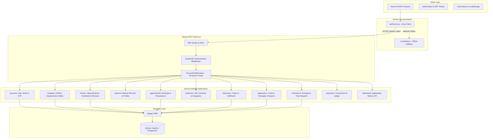
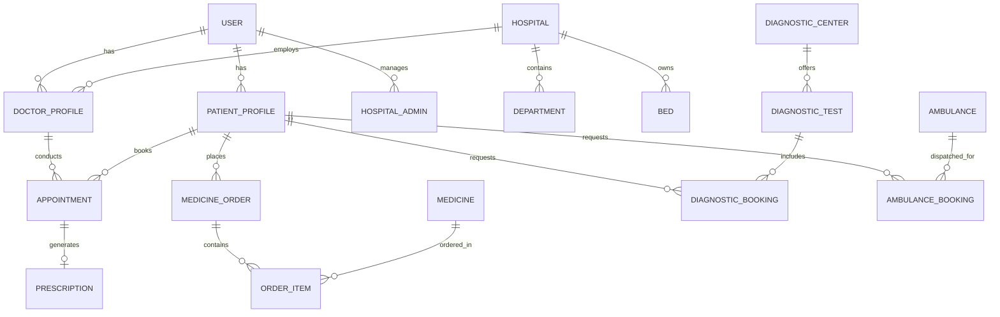

# Technical Architecture & System Design Document

## Purnia Care Healthcare Platform

---

## 1. System Overview

**Purnia Care** is an enterprise-grade digital healthcare platform engineered as a decoupled full-stack architecture. The platform features a **Django 5 REST Framework** backend providing stateless API endpoints and a **React 19 SPA (Single Page Application)** frontend built with Vite and Tailwind CSS v4.

---

## 2. Architectural Blueprint



---

## 3. Core Technical Decisions

### 3.1 Role-Based Access Control (RBAC) & Custom User Model
The `accounts` app implements a customized `AbstractUser` model (`User`) that centralizes identity and access management across 6 distinct system roles:
- `PATIENT`: Access to personal medical history, appointment bookings, cart ordering, diagnostic package tests.
- `DOCTOR`: Access to consultation schedules, patient records, prescription issuance, rating reviews.
- `HOSPITAL_ADMIN`: Full administrative control over hospital bed allocations (General/ICU/Oxygen), department staffing, emergency admissions.
- `SUPER_ADMIN`: System-wide access to platform performance charts, user accounts, and financial transactions.
- `DIAGNOSTIC_ADMIN`: Control over test package pricing, appointment slots, and lab report uploads.
- `AMBULANCE_DRIVER`: Emergency dispatch acceptance, real-time status updates (`IDLE`, `DISPATCHED`, `COMPLETED`).

### 3.2 Global Custom Response Format (`PurniaJSONRenderer`)
To ensure frontend API consumption remains clean and predictable across all 13 Django domain apps, the backend enforces a standard JSON response wrapper located in `common/renderers.py`:

```json
{
  "success": true,
  "message": "Operation completed successfully",
  "data": {
    "id": 1,
    "user": "aman_verma",
    "role": "PATIENT"
  }
}
```

In the event of validation failures or server exceptions:
```json
{
  "success": false,
  "message": "Validation Error",
  "errors": [
    "Invalid appointment date selected."
  ]
}
```

### 3.3 Soft Delete & Base Audit Model Pattern
All domain models subclass `common.models.BaseModel`, providing automatic auditability and non-destructive soft deletion:
- `created_at`: Datetime timestamp when record was created.
- `updated_at`: Datetime timestamp of last mutation.
- `is_deleted`: Boolean flag indicating if record is soft-deleted.
- `deleted_at`: Datetime timestamp when soft-deletion occurred.

---

## 4. Domain Data Model Relationships



---

## 5. Security & Authentication Architecture

1. **Stateless JWT Tokens**:
   - `POST /api/token/`: Returns `access` token (short-lived) and `refresh` token (long-lived).
   - `POST /api/token/refresh/`: Obtains new access token without re-entering credentials.
2. **CORS & Middleware Security**:
   - Configured via `django-cors-headers` to restrict unauthorized origin domains.
   - `RestrictedRolePermission` enforces strict endpoint authorization based on user role.

---

## 6. Frontend Architecture & Resilience

1. **Vite + React 19 Build**:
   - Zero-delay HMR during development.
   - Optimized tree-shaking and dynamic import splitting for production builds.
2. **Hybrid Network Resilience Layer**:
   - `apiService.js` attempts REST requests to `http://localhost:8000/api/` (or production API).
   - In case of offline operation or client demonstration without a running Django instance, API service seamlessly falls back to `mockData.js`, ensuring zero downtime during previews.

---

## 7. Production Deployment Pipeline

- **Backend**: Managed via `render.yaml` Blueprint targeting Python 3.10 runtime + Gunicorn + PostgreSQL database.
- **Frontend**: Single Command SPA deployment to Vercel or GitHub Pages (`npm run deploy`).
